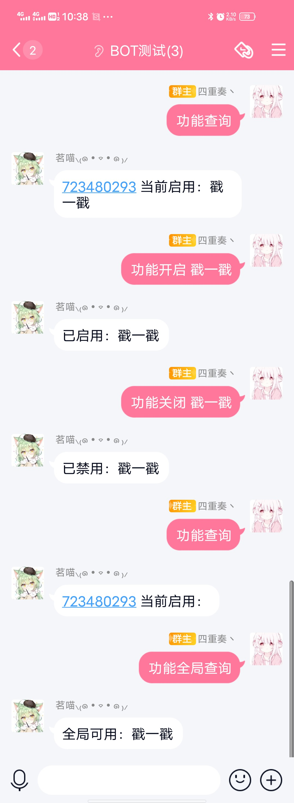

<!--
 * @Author       : Lancercmd
 * @Date         : 2020-11-17 19:05:26
 * @LastEditors  : Lancercmd
 * @LastEditTime : 2021-01-04 14:48:32
 * @Description  : None
 * @GitHub       : https://github.com/Lancercmd
-->
# nonebot_plugin_rauthman

- 基于 [nonebot / nonebot2](https://github.com/nonebot/nonebot2)

## 功能

- 基于规则的授权管理

## 安装

建议使用 poetry

- 通过 poetry 添加到 `nonebot2` 项目的 `pyproject.toml`

``` {.sourceCode .bash}
poetry add nonebot-plugin-rauthman
```

- 也可以通过 pip 从 [PyPI](https://pypi.org/project/nonebot-plugin-rauthman/) 安装

``` {.sourceCode .bash}
pip install nonebot-plugin-rauthman
```

- 在 `nonebot2` 项目中设置 `nonebot.load_plugin()`
> 当使用 [nb-cli](https://github.com/nonebot/nb-cli) 添加本插件时，该条会被自动添加

``` {.sourceCode .python}
nonebot.load_plugin('nonebot_plugin_rauthman')
```

- 参照下文在 `nonebot2` 项目的环境文件 `.env.*` 中添加配置项

## 配置项

- 授权管理信息保存位置（必须）：

  `savedata: str` 保存相对路径，示例意为保存至运行目录下的 `Yuni/savedata` 目录

``` {.sourceCode .bash}
  savedata = Yuni/savedata
```

- 授权管理应用策略（可选）：

  `0` 根据可用功能授权，当功能在群聊的可用功能列表内时为可用（默认值）

  `1` 根据功能级别授权，当群聊级别不低于功能所需级别时为可用

``` {.sourceCode .bash}
auth_policy = 0
```

- 授权管理指令所需的参数（可选）：

  `auth_command: str` 指令名，默认为 `auth`

  `auth_add: str` 启用功能（根据可用功能授权），默认为 `-a`

  `auth_rm: str` 禁用功能（根据可用功能授权），默认为 `-rm`

  `auth_show: str` 展示群功能状态（根据可用功能授权），默认为 `-s`

  `auth_available: str` 展示全局可用功能（根据可用功能授权），默认为 `-av`

``` {.sourceCode .bash}
auth_command = auth
auth_add = -a
auth_rm = -rm
auth_show = -s
auth_available = -av
```

- 为需要管理的 `on_*` 事件设置规则授权，示例意为将一个 `on_command` 事件划入一个名为 `servicename` 的功能，同时设置功能级别 `1`

``` {.sourceCode .python}
  from nonebot.plugin import on_command
  from nonebot_plugin_rauthman import isInService

  command = on_command('cmd', rule=isInService('servicename', 1))
```

- 这样，群聊必须被启用了该功能，或功能级别高于指定值（取决于当前应用的授权管理应用策略）才会进入事件处理

## 小白案例

- 基于以下配置文件

```.env.*
auth_command = 功能 # 指令名，默认为 auth
auth_add = 开启 # 启用功能（根据可用功能授权），默认为 -a
auth_rm = 关闭 # 禁用功能（根据可用功能授权），默认为 -rm
auth_show = 查询 # 展示群功能状态（根据可用功能授权），默认为 -s
auth_available = 全局查询 # 展示全局可用功能（根据可用功能授权），默认为 -av
```

- 事件响应器如下

```python
notice = on_notice(rule=to_me()&isInService('戳一戳', 1), priority=1, block=True)
```

- 使用过程
- 

## 常见问题

- 这个插件可以做到什么？

  RAM可以实现对不同群，不同功能的控制
  
- 提示群聊未注册是怎么回事？

  本地json文件中没有对群进行注册，bot第一次加群请先 auth-a xxx 或者 auth-rm xxx
  
- 谁可以开启/关闭功能？

  SUPERUSERS 在 .env.* 中定义
  
- 批量录入群注册信息？

  私聊Bot 直接发送 auth 按照提示操作即可
  
- 我设置了 auth_policy = 1，怎么设置群level？

  例子：auth 10 
  
  这样这个群的level就被设定成10 level默认为0
  
- 如果我希望在一个群中，管理员和群主可以修改开关/设置群level，我该怎么办？

  源代码第108行 修改
  
  ```python
  manager = on_command(options.command, permission=SUPERUSER, block=True)
  ```
  
  为
  
  ```python
  manager = on_command(options.command, permission=SUPERUSER | OWNER |  ADMIN, block=True)
  ```

## 特别感谢

- [Mrs4s / go-cqhttp](https://github.com/Mrs4s/go-cqhttp)
- [nonebot / nonebot2](https://github.com/nonebot/nonebot2)

## 优化建议

如有优化建议请积极提交 Issues 或 Pull requests